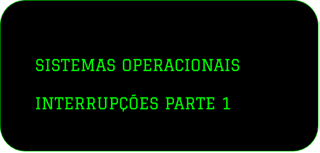
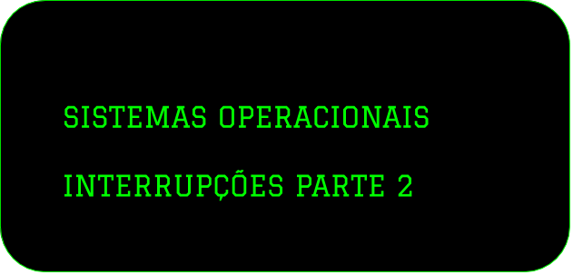
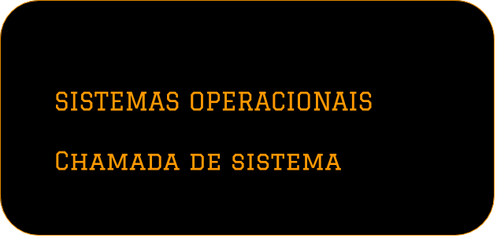
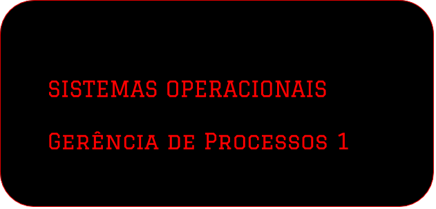
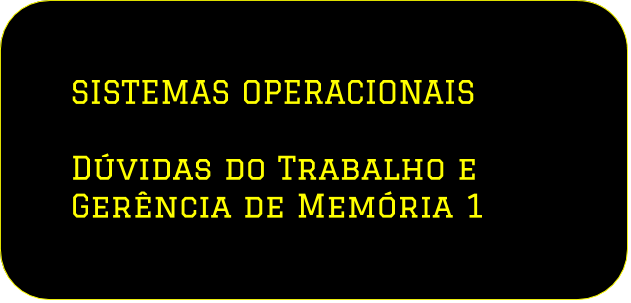
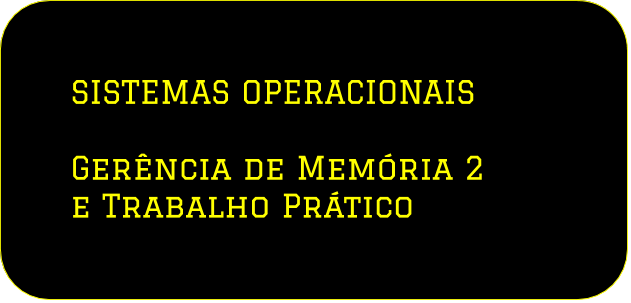

[Página Inicial](Home)|
|---|

# Videos das Aulas do Professor de Sistemas Operacionais 2020/1

**PARA ACESSAR O VÍDEO CLIQUE NA IMAGEM DO CONTEÚDO**

---

* [Como Configurar os Videos para aparecer aqui](../tutoriais/video_compartilhado)

---

### Interrupções do Sistema Operacional

---

---

---

---

---

---

### Chamada de Sistema

---

---

### Gerência de Processos

---

---

---

---

### Dúvidas e Gerência de Memória

---

---

---

---