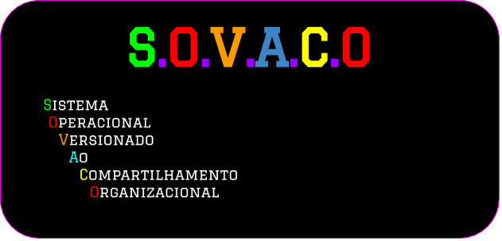

[Página Inicial](Home)|
|---|

# Como Gerênciar Páginas de Wiki

* Escrever em uma Wiki nada mais nada menos é como escrever um Programa.
* Temos que definir os links e informações que serão mostrados, para isso existem formas fáceis de mexer com uma Wiki

### Conteúdo 1: NÃO ALTERAR A WIKI PELA WEB

---

* A wiki, sendo no Github,Gitlab ou BitBucket funcionam de duas Formas:
    1. Pode Gerênciar uma Página pela própria Web 
    2. Pode Gerênciar as Páginas usando um Editor de Texto

* A primeira forma é a pior forma de mexer com Wikis, devido que como trabalhamos com imagens e links, é extremamente não prático mexermos com essas informações pela web
* Imagens e Links podem quebrar se for mudado de localização e isso pode ser uma grande dor de cabeça com o tempo, para isso usamos editores de texto para trabalharmos.

---

### Conteúdo 2: COMO GERÊNCIAR SUA WIKI

---

* Uma Wiki nada mais é que um Repositório que pode ser baixado para editar, onde funciona da seguinte forma:
    * O link de um repositório normal, como este, para clonar é o seguinte:
        * `https://github.com/F4NT0/SISOP.git`
    * O link de uma Wiki, como deste projeto possui um **.wiki**, como exemplo:
        * `https://github.com/F4NT0/SISOP.wiki.git`
<br>

* Para baixar a Wiki de um projeto, faça como o .gif abaixo


---

### Conteúdo 3: COMO COLOCAR IMAGENS

---

* Nunca coloque uma imagem como **Attach** direto pela web, porque com isso a imagem fica em um limbo de links aleatorios criados pelo Github, fazendo com que quando migrar a wiki é perdido todas as fotos e videos.

* Para colocar imagem se deve colocar a imagem dentro de um diretório pelo seu editor de texto favorito, onde você cria o Diretório e coloca as imagens.

* Abaixo o exemplo deste Diretório


* Depois de colocado a imagem no Diretório, devemos chamar a imagem no texto markdown por via de tag ou por via de estrutura de imagem:

**Chamando por Tag**

* Podemos utilizar a tag de imagem do HTML para poder chamar uma imagem de dentro do nosso diretório, como no diretório acima queremos pegar a logo do nosso Sistema Operacional:
* O caminho até a Imagem é `images/sovaco_logo.png`
* Se o seu arquivo Markdown se encontra no Diretório Raiz de sua wiki(o diretório principal da wiki) fica mais fácil de chamar o caminho até o diretório, ficando assim

```html

```

* Se estiver mais interno, vai colocando **..** até o local da imagem,como por exemplo

```html

```

* Com a estrutura da Tag podemos redefinir o tamanho da imagem como quisermos, onde somente temos que chamar o **Width** ou o **Height** que queremos da imagem.

```html

```

**Chamando por Estrutura de Imagem**

* Markdown possui uma estrutura própria que serve para chamar uma imagem da mesma forma que a tag, mas não podemos alterar o tamnho ou modificar ela.
* Essa estrutura é assim:  ``
* Colocamos dentro dos **[]** o nome da imagem que queremos
* Colocamos dentro dos **()** o caminho até a imagem

```markdown

```

---

### Conteúdo 4: COMO ESCREVER EM MARKDOWN

#### GLOSSÁRIO

* [CRIANDO ABA DE TELAS](gerenciando_wiki#abaTelas)
* [COLOCANDO TEXTO EM NEGRITO](gerenciando_wiki#negrito)
* [COLOCANDO TEXTO EM ITALICO](gerenciando_wiki#italico)
* [MARCANDO TEXTO ESPECIFICO](gerenciando_wiki#marcado)
* [CRIANDO TABELAS](gerenciando_wiki#tabelas)
* [TITULOS](gerenciando_wiki#titulos)
* [DIVISAO DE TEXTOS](gerenciando_wiki#divisao)
* [SEPARANDO TEXTOS](gerenciando_wiki#separacao)
* [COLOCANDO CÓDIGO NO TEXTO](gerenciando_wiki#codigo)
* [LINK DE ACESSO RÁPIDO](gerenciando_wiki#links)
* [COLOCANDO MARCAÇÃO DE TECLADO](gerenciamento_wiki#keyboard)
* [EMOJIS](gerenciando_wiki#emojis)

---

* Markdown é uma Linguagem de Texto que estrutura como o Texto vai aparecer, essa Wiki toda é feita utilizando essa linguagem.
* Existem estruturas especificas para usar quando escreve em Markdown, onde podemos inventar coisas interessantes com elas.

<a name="abaTelas"></a>

**CRIANDO ABA DE TELAS**
|---|

| * Podemos criar um Header com todos os Links vinculando telas, onde usamos a seguinte estrutura

```markdown
[]()
|---|
```
* O simbolo `[]()` serve para colocarmos o nome da tela(nos **[]**) e o link para o Markdown da tela(nos **()**).
* O simbolo `|---|` serve para estruturar esse link como em uma **Aba**, onde cada link deve ter um desses.
* Exemplo em Markdown:

```markdown
[Página Inicial](Home)|[Aulas do Professor](Aulas_Professor)
|---|---|
```

* Exemplo na prática:

[Página Inicial](Home)|[Aulas do Professor](Aulas_Professor)
|---|---||


<a name="negrito"></a>

**COLOCANDO TEXTO EM NEGRITO**

* Podemos colocar o texto que estamos escrevendo em negrito usando `**` em cada lado do texto.
* Exemplo em Markdown:

```text
**Texto**
```

* Exemplo na Prática: **Texto**

<a name="italico"></a>

**COLOCANDO O TEXTO EM ITÁLICO**

* Podemos colocar o texto que estamos trabalhando em itálico usando `_` em cada lado do texto.
* Exemplo em Markdown:

```text
_Texto_
```

* Exemplo na prática: _Texto_

<a name="marcado"></a>

**MARCANDO TEXTO ESPECIFICO**

* Se usar **`** em cada lado do texto vai fazer com que o texto fique sublinhado
* Exemplo em Markdown:

```text
`Texto`
```

* Exemplo na prática: `Texto`

<a name="tabelas"></a>

**CRIANDO TABELAS**

* Podemos criar facilmente tabelas, onde somente temos que dividir em colunas usando **|**.
* Para marcar o titulo das Colunas, devemos embaixo de cada titulo colocar **|---|**
* Exemplo em Markdown:

```markdown
Primeia Coluna | Segunda Coluna
|---|---|
Linha 1, Coluna 1| Linha 1, Coluna 2
Linha 2, Coluna 1| Linha 2, Coluna 2
```

* Exemplo na Prática:

Primeia Coluna | Segunda Coluna
|---|---|
Linha 1, Coluna 1| Linha 1, Coluna 2
Linha 2, Coluna 1| Linha 2, Coluna 2


<a name="titulos"></a>

**TÍTULOS**

* Podemos colocar um Título em cada página da Wiki usando uma **#** antes de cada titulo
* Quanto mais **#** colocamos, menor o título vai ficando
* Exemplo em Markdown:

```markdown
# Titulo Maior
## Sub-titulo Menor
### Menor ainda
#### Menor ainda
```

* Exemplo prático:

# Titulo Maior
## Sub-titulo Menor
### Menor ainda
#### Menor ainda

<a name="divisao"></a>

**DIVISÃO DE TEXTOS**

* Usamos os Símbolos **---** antes e depois de um texto para deixar ele separado do resto
* Exemplo em Markdown:

```markdown
---

Texto Separado

---

```

* Exemplo na prática:

---

Texto Separado

---

<a name="separacao"></a>

**SEPARANDO TEXTOS**

* Como você pode ter percebido, existe um ponto escuro no inicio de cada linha de texto, esse ponto é um `*` colocado no inicio de cada linha de texto, onde com ele podemos separar o texto em tópicos.
* Quando mais `*` forem colocado com um espaço ele vai criando sub-tópicos para um assunto.
* Exemplo em Markdown:

```markdown
* A
    * A.1
        * A.1.1
            * A.1.1.1
```

* Exemplo Prático:

* A
    * A.1
        * A.1.1
            * A.1.1.1

* Podemos também usar números, colocando um ponto do lado do número
* Exemplo em Markdown:

```markdown
1. A
    1. A.1
2. B
    1. B.1
        1. B.1.1
```

* Exemplo na Prática:

1. A
    1. A.1
2. B
    1. B.1
        1. B.1.1


<a name="codigo"></a>

**COLOCANDO CÓDIGO NO TEXTO**

* Uma coisa incrivel do Markdown é que podemos fazer highlight de código usando a seguinte estrutura em Markdown:


* Sempre coloque o nome da linguagem que deseja fazer highlight depois dos primeiros **```**

* Na prática fica assim:

```java
public class Teste{
    public static void main(String[] args){
        System.out.println("Hello World"):
    }
}
```

<a name="links"></a>

**LINK DE ACESSO RÁPIDO**

* Podemos colocar uma tag em uma área do Texto para o sistema ir mais rápido até o conteúdo se ele for muito extenso.
* Criamos a estrutura de Links, mas de vez de enviarmos para outro arquivo marcamos este arquivo e criamos um nome **Alias** para utilizar.
* Exemplo:

```markdown
[Arquivos](gerenciando_wiki#linkAcessoRapido)
```
* O que vem depois do nome **gereniando_wiki** (que deve ser o nome deste arquivo markdown) e do **#** é uma Alias que poderemos usar em qualquer parte do nosso Código.
* Para chamar o Alias, devemos usar a seguinte tag:

```html
<a name="linkAcesspRapido"></a>
```

* Dessa forma, podemos colocar o Link no inicio desse Arquivo(que já existe) e ele vai enviar o arquivo direto para onde se encontra a tag, salvando tempo de ficar procurando texto.


<a name="emojis"></a>

**EMOJIS**

* Podemos colocar Emojis em Markdown, somente passando o código dele
Abaixo a lista de todos os Emojis que o Github aceita:

People

| :bowtie: `:bowtie:` | :smile: `:smile:` | :laughing: `:laughing:` |
|---|---|---|
| :blush: `:blush:` | :smiley: `:smiley:` | :relaxed: `:relaxed:` |
| :smirk: `:smirk:` | :heart_eyes: `:heart_eyes:` | :kissing_heart: `:kissing_heart:` |
| :kissing_closed_eyes: `:kissing_closed_eyes:` | :flushed: `:flushed:` | :relieved: `:relieved:` |
| :satisfied: `:satisfied:` | :grin: `:grin:` | :wink: `:wink:` |
| :stuck_out_tongue_winking_eye: `:stuck_out_tongue_winking_eye:` | :stuck_out_tongue_closed_eyes: `:stuck_out_tongue_closed_eyes:` | :grinning: `:grinning:` |
| :kissing: `:kissing:` | :kissing_smiling_eyes: `:kissing_smiling_eyes:` | :stuck_out_tongue: `:stuck_out_tongue:` |
| :sleeping: `:sleeping:` | :worried: `:worried:` | :frowning: `:frowning:` |
| :anguished: `:anguished:` | :open_mouth: `:open_mouth:` | :grimacing: `:grimacing:` |
| :confused: `:confused:` | :hushed: `:hushed:` | :expressionless: `:expressionless:` |
| :unamused: `:unamused:` | :sweat_smile: `:sweat_smile:` | :sweat: `:sweat:` |
| :disappointed_relieved: `:disappointed_relieved:` | :weary: `:weary:` | :pensive: `:pensive:` |
| :disappointed: `:disappointed:` | :confounded: `:confounded:` | :fearful: `:fearful:` |
| :cold_sweat: `:cold_sweat:` | :persevere: `:persevere:` | :cry: `:cry:` |
| :sob: `:sob:` | :joy: `:joy:` | :astonished: `:astonished:` |
| :scream: `:scream:` | :neckbeard: `:neckbeard:` | :tired_face: `:tired_face:` |
| :angry: `:angry:` | :rage: `:rage:` | :triumph: `:triumph:` |
| :sleepy: `:sleepy:` | :yum: `:yum:` | :mask: `:mask:` |
| :sunglasses: `:sunglasses:` | :dizzy_face: `:dizzy_face:` | :imp: `:imp:` |
| :smiling_imp: `:smiling_imp:` | :neutral_face: `:neutral_face:` | :no_mouth: `:no_mouth:` |
| :innocent: `:innocent:` | :alien: `:alien:` | :yellow_heart: `:yellow_heart:` |
| :blue_heart: `:blue_heart:` | :purple_heart: `:purple_heart:` | :heart: `:heart:` |
| :green_heart: `:green_heart:` | :broken_heart: `:broken_heart:` | :heartbeat: `:heartbeat:` |
| :heartpulse: `:heartpulse:` | :two_hearts: `:two_hearts:` | :revolving_hearts: `:revolving_hearts:` |
| :cupid: `:cupid:` | :sparkling_heart: `:sparkling_heart:` | :sparkles: `:sparkles:` |
| :star: `:star:` | :star2: `:star2:` | :dizzy: `:dizzy:` |
| :boom: `:boom:` | :collision: `:collision:` | :anger: `:anger:` |
| :exclamation: `:exclamation:` | :question: `:question:` | :grey_exclamation: `:grey_exclamation:` |
| :grey_question: `:grey_question:` | :zzz: `:zzz:` | :dash: `:dash:` |
| :sweat_drops: `:sweat_drops:` | :notes: `:notes:` | :musical_note: `:musical_note:` |
| :fire: `:fire:` | :hankey: `:hankey:` | :poop: `:poop:` |
| :shit: `:shit:` | :+1: `:+1:` | :thumbsup: `:thumbsup:` |
| :-1: `:-1:` | :thumbsdown: `:thumbsdown:` | :ok_hand: `:ok_hand:` |
| :punch: `:punch:` | :facepunch: `:facepunch:` | :fist: `:fist:` |
| :v: `:v:` | :wave: `:wave:` | :hand: `:hand:` |
| :raised_hand: `:raised_hand:` | :open_hands: `:open_hands:` | :point_up: `:point_up:` |
| :point_down: `:point_down:` | :point_left: `:point_left:` | :point_right: `:point_right:` |
| :raised_hands: `:raised_hands:` | :pray: `:pray:` | :point_up_2: `:point_up_2:` |
| :clap: `:clap:` | :muscle: `:muscle:` | :metal: `:metal:` |
| :fu: `:fu:` | :walking: `:walking:` | :runner: `:runner:` |
| :running: `:running:` | :couple: `:couple:` | :family: `:family:` |
| :two_men_holding_hands: `:two_men_holding_hands:` | :two_women_holding_hands: `:two_women_holding_hands:` | :dancer: `:dancer:` |
| :dancers: `:dancers:` | :ok_woman: `:ok_woman:` | :no_good: `:no_good:` |
| :information_desk_person: `:information_desk_person:` | :raising_hand: `:raising_hand:` | :bride_with_veil: `:bride_with_veil:` |
| :person_with_pouting_face: `:person_with_pouting_face:` | :person_frowning: `:person_frowning:` | :bow: `:bow:` |
| :couplekiss: `:couplekiss:` | :couple_with_heart: `:couple_with_heart:` | :massage: `:massage:` |
| :haircut: `:haircut:` | :nail_care: `:nail_care:` | :boy: `:boy:` |
| :girl: `:girl:` | :woman: `:woman:` | :man: `:man:` |
| :baby: `:baby:` | :older_woman: `:older_woman:` | :older_man: `:older_man:` |
| :person_with_blond_hair: `:person_with_blond_hair:` | :man_with_gua_pi_mao: `:man_with_gua_pi_mao:` | :man_with_turban: `:man_with_turban:` |
| :construction_worker: `:construction_worker:` | :cop: `:cop:` | :angel: `:angel:` |
| :princess: `:princess:` | :smiley_cat: `:smiley_cat:` | :smile_cat: `:smile_cat:` |
| :heart_eyes_cat: `:heart_eyes_cat:` | :kissing_cat: `:kissing_cat:` | :smirk_cat: `:smirk_cat:` |
| :scream_cat: `:scream_cat:` | :crying_cat_face: `:crying_cat_face:` | :joy_cat: `:joy_cat:` |
| :pouting_cat: `:pouting_cat:` | :japanese_ogre: `:japanese_ogre:` | :japanese_goblin: `:japanese_goblin:` |
| :see_no_evil: `:see_no_evil:` | :hear_no_evil: `:hear_no_evil:` | :speak_no_evil: `:speak_no_evil:` |
| :guardsman: `:guardsman:` | :skull: `:skull:` | :feet: `:feet:` |
| :lips: `:lips:` | :kiss: `:kiss:` | :droplet: `:droplet:` |
| :ear: `:ear:` | :eyes: `:eyes:` | :nose: `:nose:` |
| :tongue: `:tongue:` | :love_letter: `:love_letter:` | :bust_in_silhouette: `:bust_in_silhouette:` |
| :busts_in_silhouette: `:busts_in_silhouette:` | :speech_balloon: `:speech_balloon:` | :thought_balloon: `:thought_balloon:` |
| :feelsgood: `:feelsgood:` | :finnadie: `:finnadie:` | :goberserk: `:goberserk:` |
| :godmode: `:godmode:` | :hurtrealbad: `:hurtrealbad:` | :rage1: `:rage1:` |
| :rage2: `:rage2:` | :rage3: `:rage3:` | :rage4: `:rage4:` |
| :suspect: `:suspect:` | :trollface: `:trollface:` | 

Nature

| :sunny: `:sunny:` | :umbrella: `:umbrella:` | :cloud: `:cloud:` |
|---|---|---|
| :snowflake: `:snowflake:` | :snowman: `:snowman:` | :zap: `:zap:` |
| :cyclone: `:cyclone:` | :foggy: `:foggy:` | :ocean: `:ocean:` |
| :cat: `:cat:` | :dog: `:dog:` | :mouse: `:mouse:` |
| :hamster: `:hamster:` | :rabbit: `:rabbit:` | :wolf: `:wolf:` |
| :frog: `:frog:` | :tiger: `:tiger:` | :koala: `:koala:` |
| :bear: `:bear:` | :pig: `:pig:` | :pig_nose: `:pig_nose:` |
| :cow: `:cow:` | :boar: `:boar:` | :monkey_face: `:monkey_face:` |
| :monkey: `:monkey:` | :horse: `:horse:` | :racehorse: `:racehorse:` |
| :camel: `:camel:` | :sheep: `:sheep:` | :elephant: `:elephant:` |
| :panda_face: `:panda_face:` | :snake: `:snake:` | :bird: `:bird:` |
| :baby_chick: `:baby_chick:` | :hatched_chick: `:hatched_chick:` | :hatching_chick: `:hatching_chick:` |
| :chicken: `:chicken:` | :penguin: `:penguin:` | :turtle: `:turtle:` |
| :bug: `:bug:` | :honeybee: `:honeybee:` | :ant: `:ant:` |
| :beetle: `:beetle:` | :snail: `:snail:` | :octopus: `:octopus:` |
| :tropical_fish: `:tropical_fish:` | :fish: `:fish:` | :whale: `:whale:` |
| :whale2: `:whale2:` | :dolphin: `:dolphin:` | :cow2: `:cow2:` |
| :ram: `:ram:` | :rat: `:rat:` | :water_buffalo: `:water_buffalo:` |
| :tiger2: `:tiger2:` | :rabbit2: `:rabbit2:` | :dragon: `:dragon:` |
| :goat: `:goat:` | :rooster: `:rooster:` | :dog2: `:dog2:` |
| :pig2: `:pig2:` | :mouse2: `:mouse2:` | :ox: `:ox:` |
| :dragon_face: `:dragon_face:` | :blowfish: `:blowfish:` | :crocodile: `:crocodile:` |
| :dromedary_camel: `:dromedary_camel:` | :leopard: `:leopard:` | :cat2: `:cat2:` |
| :poodle: `:poodle:` | :paw_prints: `:paw_prints:` | :bouquet: `:bouquet:` |
| :cherry_blossom: `:cherry_blossom:` | :tulip: `:tulip:` | :four_leaf_clover: `:four_leaf_clover:` |
| :rose: `:rose:` | :sunflower: `:sunflower:` | :hibiscus: `:hibiscus:` |
| :maple_leaf: `:maple_leaf:` | :leaves: `:leaves:` | :fallen_leaf: `:fallen_leaf:` |
| :herb: `:herb:` | :mushroom: `:mushroom:` | :cactus: `:cactus:` |
| :palm_tree: `:palm_tree:` | :evergreen_tree: `:evergreen_tree:` | :deciduous_tree: `:deciduous_tree:` |
| :chestnut: `:chestnut:` | :seedling: `:seedling:` | :blossom: `:blossom:` |
| :ear_of_rice: `:ear_of_rice:` | :shell: `:shell:` | :globe_with_meridians: `:globe_with_meridians:` |
| :sun_with_face: `:sun_with_face:` | :full_moon_with_face: `:full_moon_with_face:` | :new_moon_with_face: `:new_moon_with_face:` |
| :new_moon: `:new_moon:` | :waxing_crescent_moon: `:waxing_crescent_moon:` | :first_quarter_moon: `:first_quarter_moon:` |
| :waxing_gibbous_moon: `:waxing_gibbous_moon:` | :full_moon: `:full_moon:` | :waning_gibbous_moon: `:waning_gibbous_moon:` |
| :last_quarter_moon: `:last_quarter_moon:` | :waning_crescent_moon: `:waning_crescent_moon:` | :last_quarter_moon_with_face: `:last_quarter_moon_with_face:` |
| :first_quarter_moon_with_face: `:first_quarter_moon_with_face:` | :moon: `:moon:` | :earth_africa: `:earth_africa:` |
| :earth_americas: `:earth_americas:` | :earth_asia: `:earth_asia:` | :volcano: `:volcano:` |
| :milky_way: `:milky_way:` | :partly_sunny: `:partly_sunny:` | :octocat: `:octocat:` |
| :squirrel: `:squirrel:` |

Objects

| :bamboo: `:bamboo:` | :gift_heart: `:gift_heart:` | :dolls: `:dolls:` |
|---|---|---|
| :school_satchel: `:school_satchel:` | :mortar_board: `:mortar_board:` | :flags: `:flags:` |
| :fireworks: `:fireworks:` | :sparkler: `:sparkler:` | :wind_chime: `:wind_chime:` |
| :rice_scene: `:rice_scene:` | :jack_o_lantern: `:jack_o_lantern:` | :ghost: `:ghost:` |
| :santa: `:santa:` | :christmas_tree: `:christmas_tree:` | :gift: `:gift:` |
| :bell: `:bell:` | :no_bell: `:no_bell:` | :tanabata_tree: `:tanabata_tree:` |
| :tada: `:tada:` | :confetti_ball: `:confetti_ball:` | :balloon: `:balloon:` |
| :crystal_ball: `:crystal_ball:` | :cd: `:cd:` | :dvd: `:dvd:` |
| :floppy_disk: `:floppy_disk:` | :camera: `:camera:` | :video_camera: `:video_camera:` |
| :movie_camera: `:movie_camera:` | :computer: `:computer:` | :tv: `:tv:` |
| :iphone: `:iphone:` | :phone: `:phone:` | :telephone: `:telephone:` |
| :telephone_receiver: `:telephone_receiver:` | :pager: `:pager:` | :fax: `:fax:` |
| :minidisc: `:minidisc:` | :vhs: `:vhs:` | :sound: `:sound:` |
| :speaker: `:speaker:` | :mute: `:mute:` | :loudspeaker: `:loudspeaker:` |
| :mega: `:mega:` | :hourglass: `:hourglass:` | :hourglass_flowing_sand: `:hourglass_flowing_sand:` |
| :alarm_clock: `:alarm_clock:` | :watch: `:watch:` | :radio: `:radio:` |
| :satellite: `:satellite:` | :loop: `:loop:` | :mag: `:mag:` |
| :mag_right: `:mag_right:` | :unlock: `:unlock:` | :lock: `:lock:` |
| :lock_with_ink_pen: `:lock_with_ink_pen:` | :closed_lock_with_key: `:closed_lock_with_key:` | :key: `:key:` |
| :bulb: `:bulb:` | :flashlight: `:flashlight:` | :high_brightness: `:high_brightness:` |
| :low_brightness: `:low_brightness:` | :electric_plug: `:electric_plug:` | :battery: `:battery:` |
| :calling: `:calling:` | :email: `:email:` | :mailbox: `:mailbox:` |
| :postbox: `:postbox:` | :bath: `:bath:` | :bathtub: `:bathtub:` |
| :shower: `:shower:` | :toilet: `:toilet:` | :wrench: `:wrench:` |
| :nut_and_bolt: `:nut_and_bolt:` | :hammer: `:hammer:` | :seat: `:seat:` |
| :moneybag: `:moneybag:` | :yen: `:yen:` | :dollar: `:dollar:` |
| :pound: `:pound:` | :euro: `:euro:` | :credit_card: `:credit_card:` |
| :money_with_wings: `:money_with_wings:` | :e-mail: `:e-mail:` | :inbox_tray: `:inbox_tray:` |
| :outbox_tray: `:outbox_tray:` | :envelope: `:envelope:` | :incoming_envelope: `:incoming_envelope:` |
| :postal_horn: `:postal_horn:` | :mailbox_closed: `:mailbox_closed:` | :mailbox_with_mail: `:mailbox_with_mail:` |
| :mailbox_with_no_mail: `:mailbox_with_no_mail:` | :door: `:door:` | :smoking: `:smoking:` |
| :bomb: `:bomb:` | :gun: `:gun:` | :hocho: `:hocho:` |
| :pill: `:pill:` | :syringe: `:syringe:` | :page_facing_up: `:page_facing_up:` |
| :page_with_curl: `:page_with_curl:` | :bookmark_tabs: `:bookmark_tabs:` | :bar_chart: `:bar_chart:` |
| :chart_with_upwards_trend: `:chart_with_upwards_trend:` | :chart_with_downwards_trend: `:chart_with_downwards_trend:` | :scroll: `:scroll:` |
| :clipboard: `:clipboard:` | :calendar: `:calendar:` | :date: `:date:` |
| :card_index: `:card_index:` | :file_folder: `:file_folder:` | :open_file_folder: `:open_file_folder:` |
| :scissors: `:scissors:` | :pushpin: `:pushpin:` | :paperclip: `:paperclip:` |
| :black_nib: `:black_nib:` | :pencil2: `:pencil2:` | :straight_ruler: `:straight_ruler:` |
| :triangular_ruler: `:triangular_ruler:` | :closed_book: `:closed_book:` | :green_book: `:green_book:` |
| :blue_book: `:blue_book:` | :orange_book: `:orange_book:` | :notebook: `:notebook:` |
| :notebook_with_decorative_cover: `:notebook_with_decorative_cover:` | :ledger: `:ledger:` | :books: `:books:` |
| :bookmark: `:bookmark:` | :name_badge: `:name_badge:` | :microscope: `:microscope:` |
| :telescope: `:telescope:` | :newspaper: `:newspaper:` | :football: `:football:` |
| :basketball: `:basketball:` | :soccer: `:soccer:` | :baseball: `:baseball:` |
| :tennis: `:tennis:` | :8ball: `:8ball:` | :rugby_football: `:rugby_football:` |
| :bowling: `:bowling:` | :golf: `:golf:` | :mountain_bicyclist: `:mountain_bicyclist:` |
| :bicyclist: `:bicyclist:` | :horse_racing: `:horse_racing:` | :snowboarder: `:snowboarder:` |
| :swimmer: `:swimmer:` | :surfer: `:surfer:` | :ski: `:ski:` |
| :spades: `:spades:` | :hearts: `:hearts:` | :clubs: `:clubs:` |
| :diamonds: `:diamonds:` | :gem: `:gem:` | :ring: `:ring:` |
| :trophy: `:trophy:` | :musical_score: `:musical_score:` | :musical_keyboard: `:musical_keyboard:` |
| :violin: `:violin:` | :space_invader: `:space_invader:` | :video_game: `:video_game:` |
| :black_joker: `:black_joker:` | :flower_playing_cards: `:flower_playing_cards:` | :game_die: `:game_die:` |
| :dart: `:dart:` | :mahjong: `:mahjong:` | :clapper: `:clapper:` |
| :memo: `:memo:` | :pencil: `:pencil:` | :book: `:book:` |
| :art: `:art:` | :microphone: `:microphone:` | :headphones: `:headphones:` |
| :trumpet: `:trumpet:` | :saxophone: `:saxophone:` | :guitar: `:guitar:` |
| :shoe: `:shoe:` | :sandal: `:sandal:` | :high_heel: `:high_heel:` |
| :lipstick: `:lipstick:` | :boot: `:boot:` | :shirt: `:shirt:` |
| :tshirt: `:tshirt:` | :necktie: `:necktie:` | :womans_clothes: `:womans_clothes:` |
| :dress: `:dress:` | :running_shirt_with_sash: `:running_shirt_with_sash:` | :jeans: `:jeans:` |
| :kimono: `:kimono:` | :bikini: `:bikini:` | :ribbon: `:ribbon:` |
| :tophat: `:tophat:` | :crown: `:crown:` | :womans_hat: `:womans_hat:` |
| :mans_shoe: `:mans_shoe:` | :closed_umbrella: `:closed_umbrella:` | :briefcase: `:briefcase:` |
| :handbag: `:handbag:` | :pouch: `:pouch:` | :purse: `:purse:` |
| :eyeglasses: `:eyeglasses:` | :fishing_pole_and_fish: `:fishing_pole_and_fish:` | :coffee: `:coffee:` |
| :tea: `:tea:` | :sake: `:sake:` | :baby_bottle: `:baby_bottle:` |
| :beer: `:beer:` | :beers: `:beers:` | :cocktail: `:cocktail:` |
| :tropical_drink: `:tropical_drink:` | :wine_glass: `:wine_glass:` | :fork_and_knife: `:fork_and_knife:` |
| :pizza: `:pizza:` | :hamburger: `:hamburger:` | :fries: `:fries:` |
| :poultry_leg: `:poultry_leg:` | :meat_on_bone: `:meat_on_bone:` | :spaghetti: `:spaghetti:` |
| :curry: `:curry:` | :fried_shrimp: `:fried_shrimp:` | :bento: `:bento:` |
| :sushi: `:sushi:` | :fish_cake: `:fish_cake:` | :rice_ball: `:rice_ball:` |
| :rice_cracker: `:rice_cracker:` | :rice: `:rice:` | :ramen: `:ramen:` |
| :stew: `:stew:` | :oden: `:oden:` | :dango: `:dango:` |
| :egg: `:egg:` | :bread: `:bread:` | :doughnut: `:doughnut:` |
| :custard: `:custard:` | :icecream: `:icecream:` | :ice_cream: `:ice_cream:` |
| :shaved_ice: `:shaved_ice:` | :birthday: `:birthday:` | :cake: `:cake:` |
| :cookie: `:cookie:` | :chocolate_bar: `:chocolate_bar:` | :candy: `:candy:` |
| :lollipop: `:lollipop:` | :honey_pot: `:honey_pot:` | :apple: `:apple:` |
| :green_apple: `:green_apple:` | :tangerine: `:tangerine:` | :lemon: `:lemon:` |
| :cherries: `:cherries:` | :grapes: `:grapes:` | :watermelon: `:watermelon:` |
| :strawberry: `:strawberry:` | :peach: `:peach:` | :melon: `:melon:` |
| :banana: `:banana:` | :pear: `:pear:` | :pineapple: `:pineapple:` |
| :sweet_potato: `:sweet_potato:` | :eggplant: `:eggplant:` | :tomato: `:tomato:` |
| :corn: `:corn:` |

Places

| :house: `:house:` | :house_with_garden: `:house_with_garden:` | :school: `:school:` |
|---|---|---|
| :office: `:office:` | :post_office: `:post_office:` | :hospital: `:hospital:` |
| :bank: `:bank:` | :convenience_store: `:convenience_store:` | :love_hotel: `:love_hotel:` |
| :hotel: `:hotel:` | :wedding: `:wedding:` | :church: `:church:` |
| :department_store: `:department_store:` | :european_post_office: `:european_post_office:` | :city_sunrise: `:city_sunrise:` |
| :city_sunset: `:city_sunset:` | :japanese_castle: `:japanese_castle:` | :european_castle: `:european_castle:` |
| :tent: `:tent:` | :factory: `:factory:` | :tokyo_tower: `:tokyo_tower:` |
| :japan: `:japan:` | :mount_fuji: `:mount_fuji:` | :sunrise_over_mountains: `:sunrise_over_mountains:` |
| :sunrise: `:sunrise:` | :stars: `:stars:` | :statue_of_liberty: `:statue_of_liberty:` |
| :bridge_at_night: `:bridge_at_night:` | :carousel_horse: `:carousel_horse:` | :rainbow: `:rainbow:` |
| :ferris_wheel: `:ferris_wheel:` | :fountain: `:fountain:` | :roller_coaster: `:roller_coaster:` |
| :ship: `:ship:` | :speedboat: `:speedboat:` | :boat: `:boat:` |
| :sailboat: `:sailboat:` | :rowboat: `:rowboat:` | :anchor: `:anchor:` |
| :rocket: `:rocket:` | :airplane: `:airplane:` | :helicopter: `:helicopter:` |
| :steam_locomotive: `:steam_locomotive:` | :tram: `:tram:` | :mountain_railway: `:mountain_railway:` |
| :bike: `:bike:` | :aerial_tramway: `:aerial_tramway:` | :suspension_railway: `:suspension_railway:` |
| :mountain_cableway: `:mountain_cableway:` | :tractor: `:tractor:` | :blue_car: `:blue_car:` |
| :oncoming_automobile: `:oncoming_automobile:` | :car: `:car:` | :red_car: `:red_car:` |
| :taxi: `:taxi:` | :oncoming_taxi: `:oncoming_taxi:` | :articulated_lorry: `:articulated_lorry:` |
| :bus: `:bus:` | :oncoming_bus: `:oncoming_bus:` | :rotating_light: `:rotating_light:` |
| :police_car: `:police_car:` | :oncoming_police_car: `:oncoming_police_car:` | :fire_engine: `:fire_engine:` |
| :ambulance: `:ambulance:` | :minibus: `:minibus:` | :truck: `:truck:` |
| :train: `:train:` | :station: `:station:` | :train2: `:train2:` |
| :bullettrain_front: `:bullettrain_front:` | :bullettrain_side: `:bullettrain_side:` | :light_rail: `:light_rail:` |
| :monorail: `:monorail:` | :railway_car: `:railway_car:` | :trolleybus: `:trolleybus:` |
| :ticket: `:ticket:` | :fuelpump: `:fuelpump:` | :vertical_traffic_light: `:vertical_traffic_light:` |
| :traffic_light: `:traffic_light:` | :warning: `:warning:` | :construction: `:construction:` |
| :beginner: `:beginner:` | :atm: `:atm:` | :slot_machine: `:slot_machine:` |
| :busstop: `:busstop:` | :barber: `:barber:` | :hotsprings: `:hotsprings:` |
| :checkered_flag: `:checkered_flag:` | :crossed_flags: `:crossed_flags:` | :izakaya_lantern: `:izakaya_lantern:` |
| :moyai: `:moyai:` | :circus_tent: `:circus_tent:` | :performing_arts: `:performing_arts:` |
| :round_pushpin: `:round_pushpin:` | :triangular_flag_on_post: `:triangular_flag_on_post:` | :jp: `:jp:` |
| :kr: `:kr:` | :cn: `:cn:` | :us: `:us:` |
| :fr: `:fr:` | :es: `:es:` | :it: `:it:` |
| :ru: `:ru:` | :gb: `:gb:` | :uk: `:uk:` |
| :de: `:de:` |

Symbols

| :one: `:one:` | :two: `:two:` | :three: `:three:` |
|---|---|---|
| :four: `:four:` | :five: `:five:` | :six: `:six:` |
| :seven: `:seven:` | :eight: `:eight:` | :nine: `:nine:` |
| :keycap_ten: `:keycap_ten:` | :1234: `:1234:` | :zero: `:zero:` |
| :hash: `:hash:` | :symbols: `:symbols:` | :arrow_backward: `:arrow_backward:` |
| :arrow_down: `:arrow_down:` | :arrow_forward: `:arrow_forward:` | :arrow_left: `:arrow_left:` |
| :capital_abcd: `:capital_abcd:` | :abcd: `:abcd:` | :abc: `:abc:` |
| :arrow_lower_left: `:arrow_lower_left:` | :arrow_lower_right: `:arrow_lower_right:` | :arrow_right: `:arrow_right:` |
| :arrow_up: `:arrow_up:` | :arrow_upper_left: `:arrow_upper_left:` | :arrow_upper_right: `:arrow_upper_right:` |
| :arrow_double_down: `:arrow_double_down:` | :arrow_double_up: `:arrow_double_up:` | :arrow_down_small: `:arrow_down_small:` |
| :arrow_heading_down: `:arrow_heading_down:` | :arrow_heading_up: `:arrow_heading_up:` | :leftwards_arrow_with_hook: `:leftwards_arrow_with_hook:` |
| :arrow_right_hook: `:arrow_right_hook:` | :left_right_arrow: `:left_right_arrow:` | :arrow_up_down: `:arrow_up_down:` |
| :arrow_up_small: `:arrow_up_small:` | :arrows_clockwise: `:arrows_clockwise:` | :arrows_counterclockwise: `:arrows_counterclockwise:` |
| :rewind: `:rewind:` | :fast_forward: `:fast_forward:` | :information_source: `:information_source:` |
| :ok: `:ok:` | :twisted_rightwards_arrows: `:twisted_rightwards_arrows:` | :repeat: `:repeat:` |
| :repeat_one: `:repeat_one:` | :new: `:new:` | :top: `:top:` |
| :up: `:up:` | :cool: `:cool:` | :free: `:free:` |
| :ng: `:ng:` | :cinema: `:cinema:` | :koko: `:koko:` |
| :signal_strength: `:signal_strength:` | :u5272: `:u5272:` | :u5408: `:u5408:` |
| :u55b6: `:u55b6:` | :u6307: `:u6307:` | :u6708: `:u6708:` |
| :u6709: `:u6709:` | :u6e80: `:u6e80:` | :u7121: `:u7121:` |
| :u7533: `:u7533:` | :u7a7a: `:u7a7a:` | :u7981: `:u7981:` |
| :sa: `:sa:` | :restroom: `:restroom:` | :mens: `:mens:` |
| :womens: `:womens:` | :baby_symbol: `:baby_symbol:` | :no_smoking: `:no_smoking:` |
| :parking: `:parking:` | :wheelchair: `:wheelchair:` | :metro: `:metro:` |
| :baggage_claim: `:baggage_claim:` | :accept: `:accept:` | :wc: `:wc:` |
| :potable_water: `:potable_water:` | :put_litter_in_its_place: `:put_litter_in_its_place:` | :secret: `:secret:` |
| :congratulations: `:congratulations:` | :m: `:m:` | :passport_control: `:passport_control:` |
| :left_luggage: `:left_luggage:` | :customs: `:customs:` | :ideograph_advantage: `:ideograph_advantage:` |
| :cl: `:cl:` | :sos: `:sos:` | :id: `:id:` |
| :no_entry_sign: `:no_entry_sign:` | :underage: `:underage:` | :no_mobile_phones: `:no_mobile_phones:` |
| :do_not_litter: `:do_not_litter:` | :non-potable_water: `:non-potable_water:` | :no_bicycles: `:no_bicycles:` |
| :no_pedestrians: `:no_pedestrians:` | :children_crossing: `:children_crossing:` | :no_entry: `:no_entry:` |
| :eight_spoked_asterisk: `:eight_spoked_asterisk:` | :eight_pointed_black_star: `:eight_pointed_black_star:` | :heart_decoration: `:heart_decoration:` |
| :vs: `:vs:` | :vibration_mode: `:vibration_mode:` | :mobile_phone_off: `:mobile_phone_off:` |
| :chart: `:chart:` | :currency_exchange: `:currency_exchange:` | :aries: `:aries:` |
| :taurus: `:taurus:` | :gemini: `:gemini:` | :cancer: `:cancer:` |
| :leo: `:leo:` | :virgo: `:virgo:` | :libra: `:libra:` |
| :scorpius: `:scorpius:` | :sagittarius: `:sagittarius:` | :capricorn: `:capricorn:` |
| :aquarius: `:aquarius:` | :pisces: `:pisces:` | :ophiuchus: `:ophiuchus:` |
| :six_pointed_star: `:six_pointed_star:` | :negative_squared_cross_mark: `:negative_squared_cross_mark:` | :a: `:a:` |
| :b: `:b:` | :ab: `:ab:` | :o2: `:o2:` |
| :diamond_shape_with_a_dot_inside: `:diamond_shape_with_a_dot_inside:` | :recycle: `:recycle:` | :end: `:end:` |
| :on: `:on:` | :soon: `:soon:` | :clock1: `:clock1:` |
| :clock130: `:clock130:` | :clock10: `:clock10:` | :clock1030: `:clock1030:` |
| :clock11: `:clock11:` | :clock1130: `:clock1130:` | :clock12: `:clock12:` |
| :clock1230: `:clock1230:` | :clock2: `:clock2:` | :clock230: `:clock230:` |
| :clock3: `:clock3:` | :clock330: `:clock330:` | :clock4: `:clock4:` |
| :clock430: `:clock430:` | :clock5: `:clock5:` | :clock530: `:clock530:` |
| :clock6: `:clock6:` | :clock630: `:clock630:` | :clock7: `:clock7:` |
| :clock730: `:clock730:` | :clock8: `:clock8:` | :clock830: `:clock830:` |
| :clock9: `:clock9:` | :clock930: `:clock930:` | :heavy_dollar_sign: `:heavy_dollar_sign:` |
| :copyright: `:copyright:` | :registered: `:registered:` | :tm: `:tm:` |
| :x: `:x:` | :heavy_exclamation_mark: `:heavy_exclamation_mark:` | :bangbang: `:bangbang:` |
| :interrobang: `:interrobang:` | :o: `:o:` | :heavy_multiplication_x: `:heavy_multiplication_x:` |
| :heavy_plus_sign: `:heavy_plus_sign:` | :heavy_minus_sign: `:heavy_minus_sign:` | :heavy_division_sign: `:heavy_division_sign:` |
| :white_flower: `:white_flower:` | :100: `:100:` | :heavy_check_mark: `:heavy_check_mark:` |
| :ballot_box_with_check: `:ballot_box_with_check:` | :radio_button: `:radio_button:` | :link: `:link:` |
| :curly_loop: `:curly_loop:` | :wavy_dash: `:wavy_dash:` | :part_alternation_mark: `:part_alternation_mark:` |
| :trident: `:trident:` | :black_square: `:black_square:` | :white_square: `:white_square:` |
| :white_check_mark: `:white_check_mark:` | :black_square_button: `:black_square_button:` | :white_square_button: `:white_square_button:` |
| :black_circle: `:black_circle:` | :white_circle: `:white_circle:` | :red_circle: `:red_circle:` |
| :large_blue_circle: `:large_blue_circle:` | :large_blue_diamond: `:large_blue_diamond:` | :large_orange_diamond: `:large_orange_diamond:` |
| :small_blue_diamond: `:small_blue_diamond:` | :small_orange_diamond: `:small_orange_diamond:` | :small_red_triangle: `:small_red_triangle:` |
| :small_red_triangle_down: `:small_red_triangle_down:` | :shipit: `:shipit:` |


